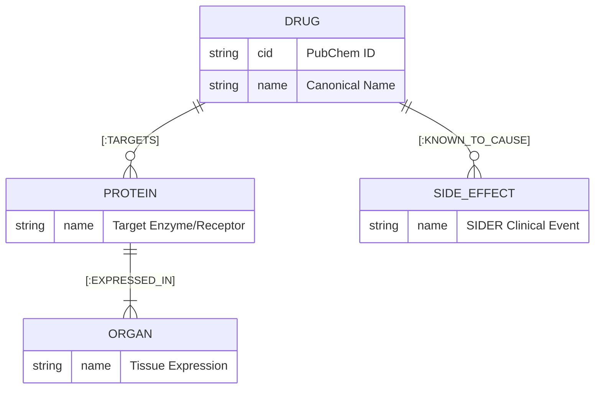

# [View Demo Video on LinkedIn](https://www.linkedin.com/posts/kesar-tripathi-364126285_graphrag-drugsafety-pharmacovigilance-activity-7450287100861620224-Q-u9?utm_source=share&utm_medium=member_desktop&rcm=ACoAAEVAaHwB0PYWh0u0WLGMGRw9Rnrqfzmh8Gc)

# PharmGuard  
Agentic GraphRAG for Automated Pharmaceutical Risk Intelligence

##  Overview
PharmGuard is a Proof-of-Concept (POC) system designed to bridge the "Evidence Gap" in pharmaceutical safety. In the modern medical landscape, official drug labels (such as SIDER) often lag months or years behind peer-reviewed findings. For safety auditors, connecting a drug's biological mechanism to emerging clinical risks documented in thousands of monthly PubMed abstracts is a massive manual challenge.

PharmGuard addresses this by using GraphRAG (Graph-Augmented Retrieval) to assist in identifying potential safety signals. By reasoning through a biological "roadmap," the system identifies potential side effects that are scientifically plausible but may not yet appear in regulatory databases.

The system is built as a Multi-Agent workflow, where specialized AI agents perform research, cross-reference biological pathways, and validate findings against primary sources to improve reliability of the generated reports.

---

##  Key Features

- **Emerging Signal Detection:** Identifies potential adverse events in scientific literature (PubMed) that are missing from official clinical labels (SIDER).  
- **Mechanistic Reasoning:** Traces a transparent causal chain: Drug → Protein Target → Organ Expression → Potential Effect.  
- **Multi-Source Integration:** Unifies relational clinical data, biological knowledge graphs, and unstructured scientific text.  
- **Critic-Validator Pipeline:** A multi-agent loop where a second "Validator" agent peer-reviews the generated report to prevent hallucinations and ensure every claim is cited.  
- **DDI Collision Mapping (Secondary):** Visually identifies metabolic bottlenecks where two drugs compete for the same enzyme.  

---

##  System Architecture

PharmGuard utilizes a hybrid architecture combining a Knowledge Graph for structural grounding and a Vector Database for scientific context.

- **Knowledge Graph (Neo4j):** Stores structured relationships between drugs, proteins, and organs.  
- **Vector DB (Pinecone):** Stores embeddings of peer-reviewed PubMed abstracts for semantic retrieval.  
- **Agent Orchestration (LangGraph + Gemini):** Manages the logic flow between data retrieval, risk synthesis, and final validation.  
- **Data Sources:** SIDER (clinical), OpenTargets (biological), and PubMed (literature).  

**System Flow:** User Input ➔ Entity Resolution ➔ Neo4j Path Query ➔ Pinecone Context Retrieval ➔ Multi-Agent Reasoning ➔ Peer-Review Validation ➔ Final Output  

graph TD
    %% User Input
    U[User Input: Drug Query] --&gt; R(Entity Resolver)
    
   ```mermaid
graph TD
    %% User Input
    U[User Input: Drug Query] --> R(Entity Resolver)
    
    %% LangGraph Orchestrator
    R --> O{LangGraph Orchestrator}
    
    %% Databases
    O -->|Mechanistic Query| N[(Neo4j Graph)]
    O -->|Semantic Search| P[(Pinecone Vector DB)]
    
    %% Data Retrieval
    N -->|Pathways| M[Biological Paths]
    P -->|PMID Abstracts| L[PubMed Literature]
    
    %% Multi-Agent Workflow
    M --> A1[🤖 Reasoner Agent]
    L --> A1
    
    A1 -->|Draft Report| A2[⚖️ Validator Agent]
    
    %% Validation Loop
    A2 -->|Rejects Uncited Claims| A1
    A2 -->|Approves Grounded Claims| F[✅ Final Risk Report]
    
    %% Styling
    classDef database fill:#f9f6f6,stroke:#333,stroke-width:2px;
    classDef agent fill:#e1f5fe,stroke:#03a9f4,stroke-width:2px;
    classDef success fill:#e8f5e9,stroke:#4caf50,stroke-width:2px;
    
    class N,P database;
    class A1,A2 agent;
    class F success;
```

---

##  Tech Stack

- **Database:** Neo4j (Graph), Pinecone (Vector)  
- **Orchestration:** LangGraph  
- **LLM:** Gemini 3 Flash  
- **Frontend:** Streamlit  
- **Language:** Python 3.10+  
- **Deployment:** Docker-ready  

---

##  How It Works

1. **Resolution:** The system resolves the user’s input to a standardized identifier (e.g., canonical drug name or internal ID) to ensure consistency across sources.  
2. **Mapping:** A Cypher query is sent to Neo4j to retrieve the mechanistic pathway (e.g., identifying that a drug targets a protein expressed in heart tissue).  
3. **Retrieval:** The system performs a semantic search in Pinecone to find relevant peer-reviewed studies discussing the drug’s effects.  
4. **Synthesis:** The Reasoner Agent compares the official SIDER labels with the retrieved literature and the biological pathway.  
5. **Validation:** The Validator Agent audits the report. If a claim isn't supported by a PMID or a graph path, the report is rejected and sent back for correction.  




---

## Example Output: Imatinib Case Study

**Query:** "Analyze Imatinib"  

- **Graph Result:** Drug targets PDGFR, which is highly expressed in the Heart.  
- **Literature Result:** PubMed studies document cardiotoxicity and heart failure.  
- **SIDER Status:** Not present in the current dataset subset (may exist in full clinical records).  

**PharmGuard Conclusion:** The agent flags a potential discrepancy, explaining that Imatinib’s action on PDGFR provides a mechanistic basis for the cardiac risks found in literature but not reflected in the available label data.

---

## Project Structure

```text
/pharmaguard
├── /data # Data ingestion scripts and source files
├── /src # Core source code
│ ├── /agents # LangGraph node definitions (Reasoner, Validator)
│ ├── /graph # Neo4j connection and Cypher queries
│ ├── /retrieval # Pinecone setup and embedding logic
│ └── /utils # Entity resolver and formatting helpers
├── app.py # Streamlit UI dashboard
├── requirements.txt # Project dependencies
└── README.md # Documentation

## Setup & Installation

### Clone the Repository
```bash
git clone https://github.com/yourusername/PharmGuard.git
cd PharmGuard
```

### Install Dependencies
```bash
pip install -r requirements.txt
```

### Environment Variables
Create a `.env` file in the root directory and add:

```plaintext
GOOGLE_API_KEY=your_gemini_key
NEO4J_URI=your_neo4j_uri
NEO4J_USERNAME=neo4j
NEO4J_PASSWORD=your_password
PINECONE_API_KEY=your_pinecone_key
```

### Run the Application
```bash
streamlit run app.py
```

## Limitations

Inference vs. Causation: The system identifies biological plausibility; it does not provide clinical proof of causation.

Graph Completeness: Reasoning is limited by the density of the current Knowledge Graph. Missing relationships can lead to false negatives.

Data Quality: Performance is dependent on the clarity of PubMed abstracts and the accuracy of the underlying databases.

Non-Validated: This tool is a Proof of Concept for research purposes and is not intended for clinical decision-making.

## Future Improvements

Pathway Expansion: Integrating Reactome or KEGG for deeper pathway-level modeling beyond simple target-organ links.

Automated Evaluation: Implementing Ragas or G-Eval metrics to quantitatively measure faithfulness and relevance.

Entity Resolution: Moving from basic string matching to a more robust, transformer-based medical entity linker (e.g., MedCAT).

Scaling: Ingesting full pharmacokinetic datasets (DrugBank) for enterprise-grade DDI detection.

##  Acknowledgements

SIDER: Side Effect Resource for clinical data labels.

OpenTargets: Biological target and organ expression associations.

PubMed: National Library of Medicine for scientific literature.
